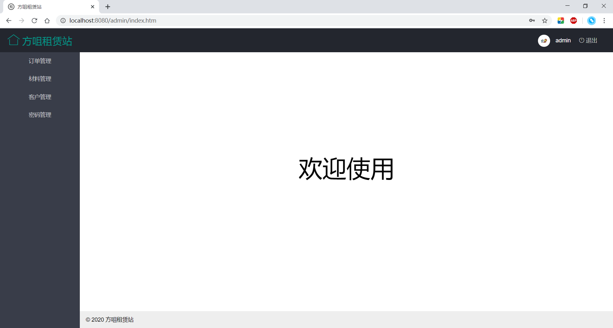
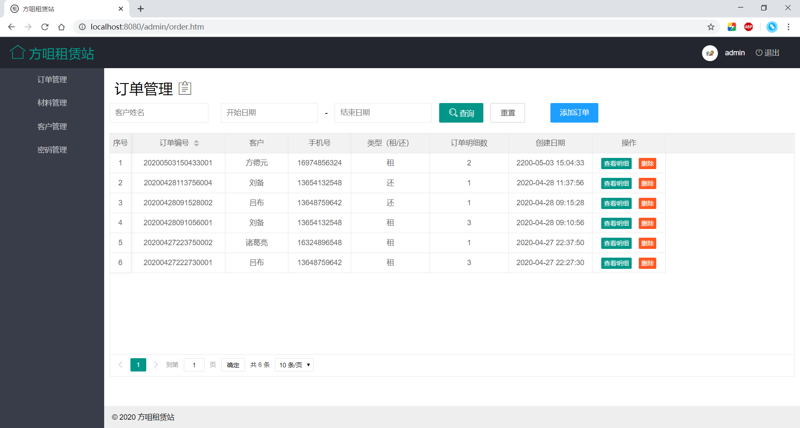
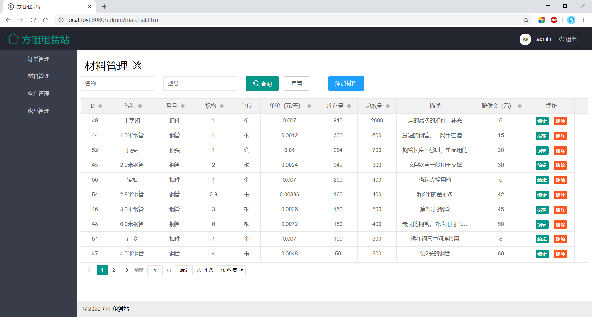
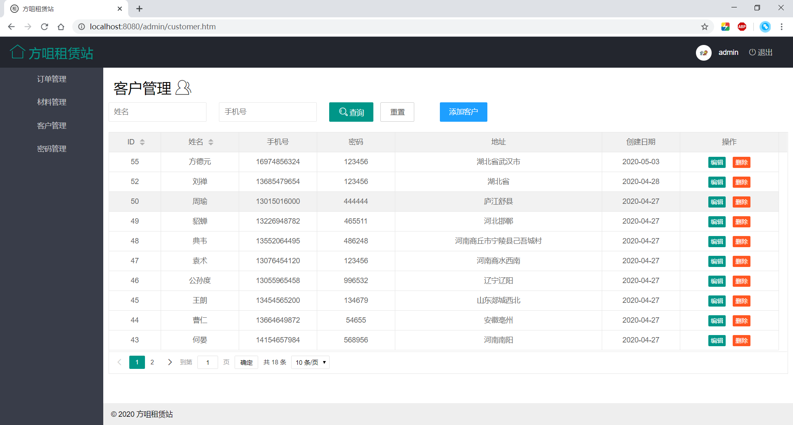
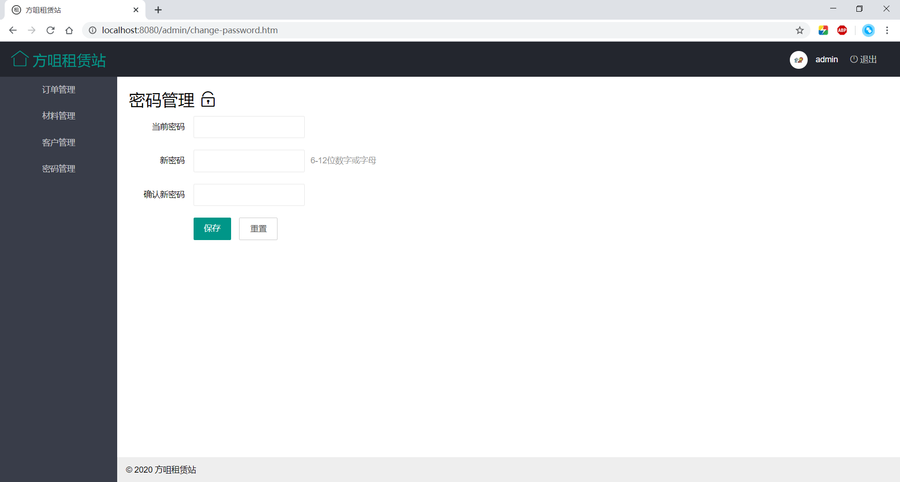
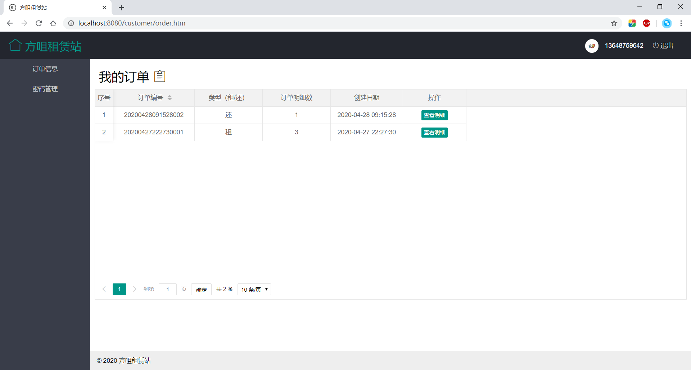

# 目录

[项目基本信息](#项目基本信息)

[开发运行环境](#开发运行环境)

[项目基本信息](#项目展示)

[讨论群](#讨论群)

---

# 项目基本信息

项目：基于Java的钢管租赁系统

作者：wowpH

日期：2020年4月28日09:00:14

# 开发运行环境

JDK：1.8.0_144
IDE：Intellij IDEA 2019.3.3
数据库：MySQL Community Server 8.0.15
服务器：Tomcat 7
浏览器：Google Chrome 81

# 项目展示

## 公共模块

### 登录页面

## 管理员模块

### 管理员首页

### 管理员订单管理

### 管理员材料管理

### 管理员客户管理

### 管理员密码管理

## 客户模块

### 客户订单信息

# 讨论群

